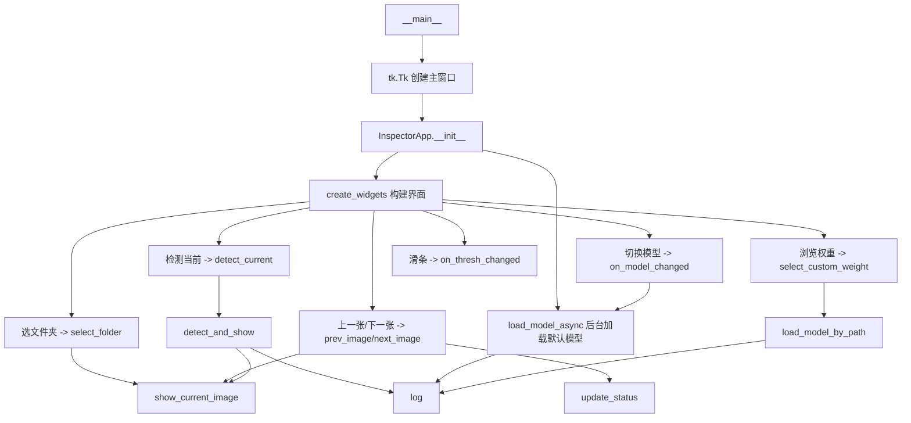

# 项目总结：基于多模态的封口质量检测系统

## 一、项目简介

本项目面向**塑料包装袋(槟榔包装)高温热封工序**，解决人工质检"主观性强、疲劳漏检、无法测温、标准不统一"等痛点。采用 **可见光(YOLO 目标检测)+ 红外热成像(温度分析)** 的多模态方案：

- **可见光**：检测封口区域内的 **银边漏出** 与 **异物** 两类外观缺陷；
- **红外**：分析封口区域温度分布，判定温度是否达标/均匀。

整体为工业质检"立项 → 数据采集 → 预处理 → 标注 → 训练 → 测试 → 部署软件"的全流程实践。

## 二、所做的工作

1. **数据预处理**：对 2448×2048 原始高清图做 ROI 裁剪 `[500:1700, 200:2400]`，等比缩放至 1184×640，聚焦封口区域、给银边和上溢异物留出容错；
2. **数据标注**：YOLO 格式标注 559 张(训练 400 / 验证 100 / 测试 59)，两类目标——银边 282 框、异物 225 框；
3. **模型训练与调优**：YOLOv8n / YOLOv11n，imgsz=640、AdamW、lr0=0.001，配合数据增强(hsv/mosaic/randaugment/erasing 等)，异物 mAP50≈0.995、召回 100%，银边 mAP50 0.81~0.84；
4. **测试软件(app.py)**：Tkinter 图形界面，支持模型切换、双类置信度阈值调节、文件夹批量检测、结果可视化、日志记录；
5. **红外温度分析(thermal_analysis.py)**：在伪彩红外图上定位封口区域，统计温度均值/方差，以标准图建立基准、z-score + 绝对容差判定异常，完成算法可行性验证；
6. **文档整理**：README 与项目总结。

## 三、关键方法

| 环节 | 方法 |
|---|---|
| 可见光缺陷检测 | YOLOv8 / YOLOv11 目标检测(Anchor-Free + DFL) |
| 数据预处理 | ROI 裁剪 + 等比缩放，减少无关背景、加速推理 |
| 图像显示与交互 | Tkinter + 多线程模型加载(避免 UI 卡顿) |
| 红外热信号提取 | 伪彩图取 `heat = R − B`(蓝冷红热) |
| 红外封口定位 | 行均值投影定垂直位置/厚度 + 列投影质心定水平中心 + 先验宽度 |
| 红外异常判定 | 温度特征 z-score + 位置绝对容差，无标签下的"标准图基准" |

## 四、主程序 app.py 与其他文件的"交流"

`app.py` 是**单文件独立程序**，不 import 项目内其他 `.py` 模块，仅依赖第三方库。它与外部文件的交互如下：

| 文件/目录 | 关系 | 说明 |
|---|---|---|
| `models/yolo/weights/*.pt` | **读取** | `MODEL_OPTIONS` 硬编码路径加载 YOLO 权重(如 `yolov8_3.pt`、`yolov11_1.pt`) |
| 图片文件夹 | **读取** | 用户通过文件对话框选择(通常为 `datasets/visible/images/test/` 或任意图片目录) |
| `requirements.txt` | **依赖声明** | 声明 `ultralytics`、`opencv-python`、`pillow` 等运行库 |
| `configs/*.yaml` | **无直接交互** | 训练超参仅供 `notebooks/yolo_training.ipynb` 使用，`app.py` 的阈值/路径为硬编码 |
| `thermal_analysis.py` | **无直接交互** | 红外分析为独立脚本，可见光与红外两路**尚未在代码层面融合** |

> 两点如实说明(面试可主动讲)：
> 1. `app.py` 与 `thermal_analysis.py` 目前相互独立，多模态融合停留在"各自输出结论、逻辑与"的层面；
> 2. `app.py` 的阈值、模型路径、ROI 参数为硬编码，未接入 `configs/`，是当前工程化可改进点。

## 五、app.py 内部结构：函数关系与调用流程

程序主体为 `InspectorApp` 类，入口在文件末尾。

### 各函数作用

| 函数 | 作用 |
|---|---|
| `__init__(root)` | 初始化窗口标题/尺寸、状态变量、两类阈值变量；调用 `create_widgets` 建界面、`load_model_async` 加载默认模型 |
| `create_widgets()` | 构建全部 UI：模型下拉框+浏览按钮、银边/异物双阈值滑条、控制按钮、图像画布、日志区、状态栏，并绑定各按钮回调 |
| `on_thresh_changed(event)` | 阈值滑条回调，实时刷新阈值标签显示 |
| `select_custom_weight()` | 弹出文件对话框选 `.pt`，转交 `load_model_by_path` |
| `load_model_by_path(path)` | 后台线程加载指定路径的自定义权重，加载前后更新光标与日志 |
| `on_model_changed(event)` | 下拉框切换回调，取键值调 `load_model_async` |
| `load_model_async(key)` | 后台线程按 `MODEL_OPTIONS` 加载预置模型，成功/失败写日志与状态栏 |
| `select_folder()` | 选图片文件夹，按后缀过滤排序成 `image_list`，启用导航/检测按钮，显示第一张 |
| `show_current_image(annotated=None)` | 显示当前图：无标注时做 ROI 裁剪+缩放，有标注时直接显示结果；自适应画布缩放居中 |
| `prev_image()` / `next_image()` | 切换上一张/下一张，清空上次检测结果并重新显示、更新状态 |
| `update_status()` | 更新状态栏"当前图片 i/N" |
| `detect_current()` | 检测入口：校验图片与模型就绪后调用 `detect_and_show`，刷新显示与日志 |
| `detect_and_show(path)` | **核心检测**：读图 → ROI 裁剪缩放 → `model.predict` → 按银边/异物各自阈值过滤 → 画框打标签 → 返回带框图和结论描述 |
| `log(msg)` | 将消息追加到日志区并自动滚动 |

> 说明：`load_model_async` 与 `load_model_by_path` 逻辑几乎一致(仅权重来源不同)，二者存在重复代码，是后续可合并重构的点。
